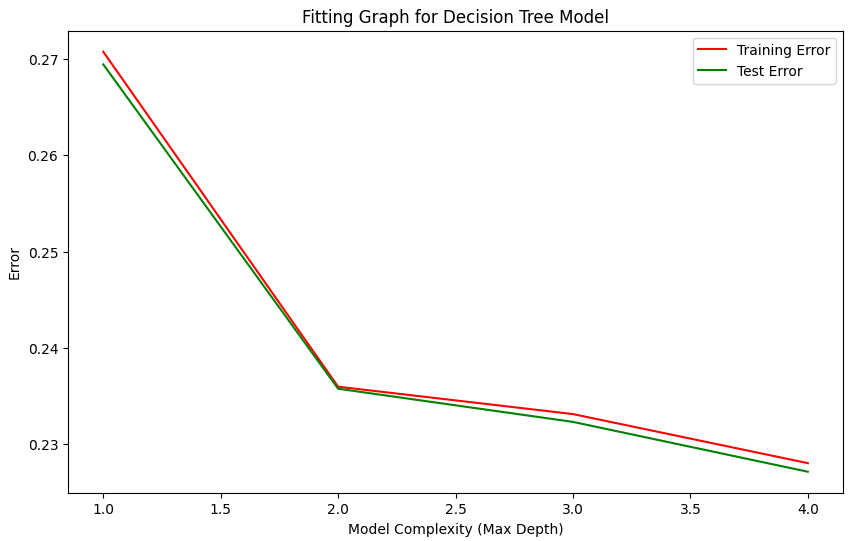

# 232R_GroupProject
UCSD Spring 2024 232R Big Data Analytics Using Spark Group Project 

**Project**: Examine US Happiness Trends with census data. 
Team Members: Taylor Witte, Donald Yu, Praveen Manimaran, Vitush Agarwal, Parker Aman

# Introduction 
Why was it chosen? Why is it cool? Discuss the general/broader impact of having a good predictive mode. i.e. why is this important?

# Methods 

## Data Exploration
For each dataset, we first looked at the number of null/missing values and took steps during preprocessing to address these issues. We also look at the number of rows and the number of variables(decide which variables to use later) and the years represented in the dataset.

Happiness Dataset: Explored the distribution of different variables such as Life Ladder, Log GDP Per Capita, Social Support, Healthy Life Expectancy at Birth, Freedom To Make Life Choices, Generosity, Positive Affect, Negative Affect, and Confidence in National Government. We also plot these variables over time to see the trends of these variables from 2012 to June 2022. We were able to notice to that that since the first year of that the report was created was in 2012 and there have been big changes since then with the happiness score decreasing over time. 

Individual Census Dataset: We investigate each variable individually, and plot the distributions of all the relevant variables to see any trends and patterns. We plotted the distribution of the entire dataset as well as demographic variables(Age, Race, Education), Marital Status Distribution, Distribution of Family sizes, Health Insurance Coverage Distribution, Employment Status Distribution, and the Hours worked per Week Distribution. 

Household Census Dataset: From initial exploration, we found that the number of households for those individuals decrease overtime and realized further analysis needs to be done to understand why. We also explored the distribution of household types(married couple family, male_no_wife, female_living_alone, etc). We also looked at the distribution of number of famileies per Household each year, housing unit types, and internet access for each household. We saw a decrease in the number of farms each year with the percentage of farms relative to households per year being fairly consistent. Our group alos saw a downward trend in the number of owned houses and explored the distribution of hosuehold weight per year. We plotted the average cost of electricity, gas, fuel, and water per year since 2012 and noticed a similar downward trend for each. The average number of vehicles increased from 2012 to 2020 but has decreased a lot from 2020 to 2022.

These data exploration methods allowed us to get a better understanding of which variables we should use and what variables need to be preprocessed before building our models.

## Preprocessing 
Variables were selected to be diverse enough to get a deep understanding of the US population and reflect the World Happiness Data variables but concise enough to be able to process. The distribution of all variables was examined to ensure the dataset was representative of the US population. For the household census dataset, each row represents an individuals but all variables were measured on a household level so the dataset was filtered to remove individuals within the same household to leave unique household instances. The World Happiness Report Dataset was filtered to only include US datapoints between the year of 2012-2022(except 2020 due to covid). All monetary variables were normalized for inflation to the 2000 dollar values. Variables that were missing from too many individuals and/or households will be removed from further analysis. For some selected categorical variables, categories were combined such as household definitions for the Group Quarters variable. For clustering, all variables were normalized using the MinMax Scaler to a 0-1 scale. Each column was scaled individually. The MinMax normalization function was selected to preserve the true distribution of each variable. Additonally,one-hot encoding was used to handle select categorical variables to create binary features. This allowed for more streamlined analysis of the variables.

## Model 1

The goal of the model 1 was to predict home ownership and renting using the individual and household datasets.
The Kmeans code first creates a "features" column in the dataset using PySpark's VectorAssembler, which consolidates all feature columns into a single vector column. This new DataFrame is then cached for efficient reuse. Next, the code determines the optimal number of clusters for K-means clustering by calculating the cost (sum of squared distances) for cluster numbers ranging from 2 to 9. The costs are plotted to visualize the elbow point, which helps in identifying the best number of clusters.The code performs K-means clustering on the dataset, setting the number of clusters to the suggested k cluster number from the elbow point. After fitting the K-means model and obtaining the cluster centers, it adds the cluster predictions to the DataFrame. Principal Component Analysis (PCA) is then applied to reduce the dimensionality of the features to two components, which are visualized in a scatter plot showing the cluster distribution. The cluster centers are plotted in a bar chart to illustrate the values of each feature per cluster. Also, a ClusteringEvaluator is used to calculate the silhouette score, providing a measure of the clustering quality.

In addition to the KMeans, Decision Tree was used to predict whether a house was owned or rented based on the four variables.  The code begins by splitting the dataset into training and testing sets using an 80-20 split. It identifies and removes irrelevant columns ("OWNERSHPD," "OWNERSHP," and "ARENTGRS") before assembling the remaining features into a single vector column for modeling. A Decision Tree Classifier is then trained on the training data, and predictions are made on the test data. The accuracy of the model is evaluated using a Multiclass Classification Evaluator. Feature importance is extracted and displayed, with a custom mapping applied to replace feature numbers and predicted class numbers with meaningful labels. Finally, the structure of the decision tree is printed with these labels, and the code calculates and prints the percentage of rented properties and those in group quarters.

## Model 2
The goal of model 2 was to predict ownership from individual demographic and household information. To begin, we chose several  variables that individuals have and do not have control of. The variables selected were Age, Race, Citizenship Status, Education Attainment, Class of Workyudon90/232R_GroupProject_donfork/model 1_result_images/Model_1_House_KMeans_PCA.png, Marital Status, Number of own family members in the household, Number of families in the household, Group Quarter Status (Household vs Group Quarters), State, Year, Household Type (Married vs Single, etc), and Person Number in Sample Unit. To build this model we tested two types of models: logistic regression and decision tree. Both gave similar accuracy __ and __ respectively. We chose the decision tree which had a slightly higher accuracy and allowed for a more understandable model. The decision tree performed feature selection by only splitting on relevant features. To mitigate overfitting we only allowed for a maximum depth of the trees but did not limit the number of samples per split node. We did not consider the household weight which indicates how representative a household is of all households which could be included in further adaptations to decrease the bias of the model. We also ran this decision tree with the total household income and without, which gave some interesting results and will be discussed in further sections.

# Results 
## Model 1 

Figure ?: Model 1 PCA Plot of Clusters for Household Census KMeans

Figure ?: Model 1 including Family Income Feature for Household Census KMeans

Figure ?: Model 1 PCA Plot of Clusters for Individual Census KMeans

Figure ?: Model 1 including Family Income Feature for Individual Census KMeans

For the Household Census Kmeans, The Cluster Center plots show the average values for each feature for the three clusters identified. Each bar represents a feature and its height reflects the mean value of that feature within the cluster. K-means idenified three clusters: households who own, households who rent and group quarters.The silhouette score is 0.351 indicating the clusters are not well-defined and distinct from each other.

For the Individual Census Kmeans, the Cluster Centers plot shows the average values of each feature for the three identified clusters. Each bar represents a feature, and its height reflects the mean value of that feature within the cluster. The features include demographic, socio-economic, and health-related variables. Notably, variables such as AINCTOT (total income), AFTOTINC (family total income), and POVERTY show significant differences across clusters, indicating that income and poverty status are key distinguishing factors among the clusters.
The silhouette score is 0.869, which is quite high. A high silhouette score close to 1 indicates that the clusters are well-defined and distinct from each other. The points within each cluster are very similar to each other and different from points in other clusters.

The decision tree was able to predict with 99% accuracy whether a house was owned or rented based on the four variables. First group quarters were excluded since they are neither rented or owned. 

## Model 2 
**Figure ?: Model 2 including Family Income Fearture**

**Figure ?: Model 2 excluding Family Income Fearture**

This fitting graph shows as the complexity (depth of trees) increases, we do continue to see an increase in accuracy, however, it is trivial. We can see the best depth to pick is 2. After this, the marginal increase in accuracy is not worth it.

# Discussion 

# Conclusion 
This is where you do a mind dump on your opinions and possible future directions. Basically what you wish you could have done differently. Here you close with final thoughts.

# Collaboration 
- **Taylor Witte:**
- **Vitush Agarwal:**
- **Donald Yu:**
- **Parker Aman:**
- **Praveen Manimaran:**
